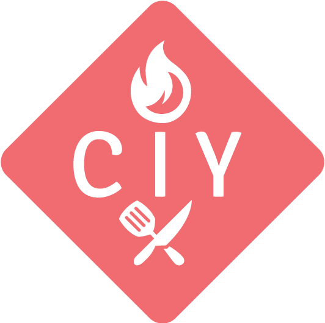

####All of your recipes in one place.

---
CIY is a web app that lets it's users create recipes and
save them online.  They can easily update and edit recipes that 
they already have in their collection.

|Table of Contents|
|-----------------|
|[1. Links](#links)|
|[2. Instructions](#instructions)|
|[3. Technologies Used](#technologies)|
|[4. Bugs](#bugs)|

## <a name="#links">Links</a>
[Trello board](https://trello.com/b/ToWQwHF0/recipe-wars)
[Deployed app on Heroku](https://ciy-v1.herokuapp.com/#/)

## <a name="#instructions">Instructions</a>
New users can sign up by clicking on the "Sign Up" link on the navigation bar.
Once signed up, users will be able to create their own recipes and have them all saved
under "My Recipes".  You can search for recipes whether or not you are signed in.

## <a name="#technologies">Technologies Used</a>

* **3rd Party API:** edamam.com
* **Lanugages:** HTML4, CSS3, JavaScript
* **Front-end Library:** jQuery
* **Front-end Frameworks:** Bootstrap, CSS Materialze

## <a name=#bugs">Bugs</a>

* Background stretches when searching or viweing recipe details
* Username and password does not clear after log-out
  
